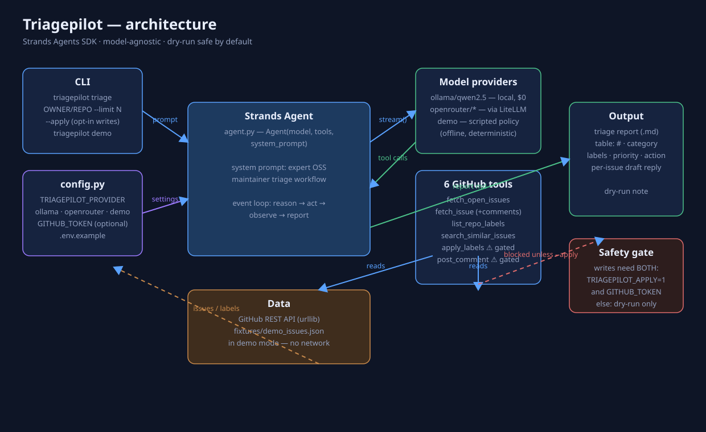

# Triagepilot — Architecture



## Overview

Triagepilot is a single **Strands agent** (`Agent` from the Strands Agents SDK)
configured as an expert open-source maintainer. One agent loop — *reason → act
(observe) → report* — drives the whole triage pass. There is no separate
orchestrator, no pipeline code: the agent decides which tools to call, in which
order, from its system prompt and the live tool results.

## Components

| Component | File | Role |
|---|---|---|
| Agent | `src/triagepilot/agent.py` | Strands `Agent(model, tools, system_prompt)`; the triage loop and report formatting live in the system prompt |
| Model providers | `src/triagepilot/config.py` | `TRIAGEPILOT_PROVIDER` → `ollama` (default, local, $0) / `openrouter` (your key, via LiteLLM) / `demo` (scripted) |
| GitHub tools (6) | `src/triagepilot/tools_github.py` | `fetch_open_issues`, `fetch_issue`, `list_repo_labels`, `search_similar_issues`, `apply_labels`, `post_comment` |
| Demo model | `src/triagepilot/demo_model.py` | Deterministic `strands.models.model.Model` implementation: drives the *real* agent tool loop against bundled fixtures, fully offline |
| CLI | `src/triagepilot/cli.py` | `triagepilot triage OWNER/REPO [--apply]`, `triagepilot demo` |
| Fixtures | `src/triagepilot/fixtures/demo_issues.json` | 6 realistic issues for fictional repo `triagepilot-demo/focusflow` |

## Data flow

```
CLI ──prompt──▶ Strands Agent ──stream()──▶ Model provider
                      │                          (Ollama / OpenRouter / demo)
                      │ tool calls
                      ▼
              GitHub tools ──▶ GitHub REST API   (live mode, stdlib urllib)
                         └─▶ fixtures/demo_issues.json  (demo mode)
                      │
                      ▼
              triage report (markdown): table + per-issue draft replies
```

## Why Strands

- **Model-agnostic by construction**: swapping Ollama → OpenRouter is one env
  var, because Strands models share one interface (`stream()`). The demo
  provider proves it — a hand-written `Model` subclass plugs straight into the
  same `Agent` with zero agent-code changes.
- **Tools as decorated functions**: `@tool` + docstring is the whole contract;
  the agent discovers argument schemas automatically.
- **Safety as a tool property**: `apply_labels` / `post_comment` refuse to
  write unless `TRIAGEPILOT_APPLY=1` *and* `GITHUB_TOKEN` are set. The agent
  cannot work around this — the gate is inside the tool, not the prompt.

## Demo model design

`ScriptedTriageModel` implements the Strands `Model` ABC (`stream`,
`structured_output`, `get_config`, `update_config`). Its policy is a small
state machine over the conversation history: fetch issues → list labels →
fetch each issue's details → emit the triage report. The *report itself* is
produced by deterministic rules (keyword classification, keyword-overlap
duplicate detection, label allow-listing against the repo's real labels) in
`triage_report()`. This is deliberately transparent: in `demo` mode every run
is byte-reproducible, which is exactly what you want for a recorded demo.
